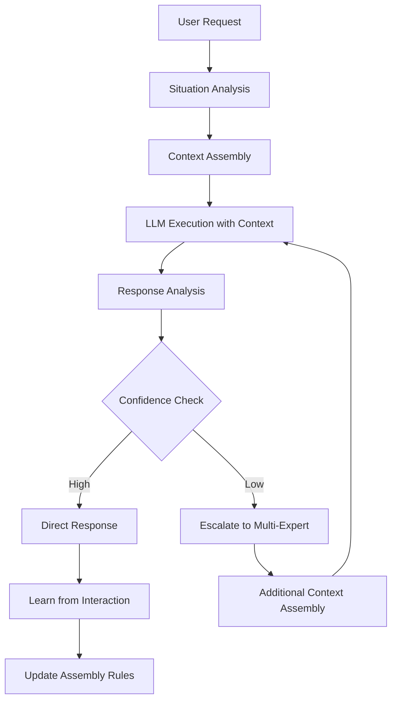

# Chapter 5: Dynamic Context Assembly

## The Revolution in Intelligence Configuration

In traditional software systems, configuration is static—set once, run forever. Semantic computing platforms flip this paradigm entirely: **intelligence configures itself** based on runtime understanding of intent, context, and evolving conditions.

Dynamic Context Assembly represents the core innovation that makes this possible. Rather than predetermined decision trees or rigid rule systems, we create intelligent assemblies that adapt, learn, and optimize in real-time. This chapter explores how MCP-CEO implements this revolutionary approach and how you can build similar systems.

## The Architecture of Adaptive Intelligence

### Beyond Static Contexts

Traditional prompt engineering treats contexts as static templates:

```yaml
# Traditional Static Approach
prompt: |
  You are a helpful assistant.
  User query: {{user_input}}
  Please respond helpfully.
```

Dynamic Context Assembly transcends this limitation by creating **living contexts** that evolve:

```yaml
# Dynamic Assembly Approach
type: "workflow"
metadata:
  name: "adaptive_response"
  confidence_threshold: 0.8
  
assembly_rules:
  - when_semantic: "user seems frustrated"
    boost_priority: ["empathy", "stress_reduction"]
  
  - if: "complexity > 0.7"
    and_semantic: "user needs expert guidance"
    activate: ["multi_expert_validation"]
    
  - while_semantic: "user still has questions"
    maintain: ["conversational_context"]
    monitor: ["engagement_signals"]
```

The difference is profound: instead of guessing what the user needs, the system **understands** what they need and assembles the appropriate intelligence dynamically.

## The Three-Layer Architecture

MCP-CEO's Dynamic Context Assembly operates through three integrated layers that work together to create emergent intelligence:

### Layer 1: FlowMind Foundation

At the foundation lies FlowMind—the universal context interface that treats everything as composable intelligence:

```javascript
class FlowMind {
  constructor(yaml_path) {
    this.raw_yaml = this.loadYAML(yaml_path);
    this.properties = new Map();
    
    // Every YAML property becomes a FlowMind property
    this.mirrorYAMLStructure(this.raw_yaml);
  }
  
  // Semantic evaluation bridge
  evaluateCondition(condition, context) {
    if (condition.includes('_semantic:')) {
      return this.llm_evaluation(condition, context);
    }
    return this.programmatic_evaluation(condition, context);
  }
}
```

This design enables **universal composability**—agents, workflows, patterns, and types all inherit from the same base, creating infinite combination possibilities.

### Layer 2: Assembly Engine

The Assembly Engine orchestrates context selection and combination through three core mechanisms:

#### Priority Resolution
```javascript
class AssemblyEngine {
  resolvePriorities(contexts, situation) {
    return contexts
      .map(ctx => ({
        context: ctx,
        priority: this.calculateDynamicPriority(ctx, situation),
        relevance: this.semanticRelevance(ctx, situation)
      }))
      .sort((a, b) => (b.priority * b.relevance) - (a.priority * a.relevance));
  }
  
  calculateDynamicPriority(context, situation) {
    let base_priority = context.metadata?.priority || 0.5;
    
    // Boost based on semantic conditions
    for (let rule of context.assembly_rules || []) {
      if (this.evaluateSemanticCondition(rule.when_semantic, situation)) {
        base_priority *= (rule.boost_priority || 1.5);
      }
    }
    
    return Math.min(base_priority, 1.0);
  }
}
```

#### Conflict Resolution
When multiple contexts provide competing guidance, the engine uses **semantic arbitration**:

```javascript
resolveConflicts(competing_contexts, situation) {
  // Semantic coherence scoring
  const coherence_scores = competing_contexts.map(ctx => 
    this.semanticCoherence(ctx, situation)
  );
  
  // Confidence-based selection
  const confidence_scores = competing_contexts.map(ctx =>
    this.llm_confidence(ctx, situation)
  );
  
  // Combined resolution
  return competing_contexts.reduce((best, current, index) => {
    const combined_score = coherence_scores[index] * confidence_scores[index];
    return combined_score > best.score ? 
      { context: current, score: combined_score } : best;
  }, { context: null, score: 0 });
}
```

#### Relevance Calculation
The engine continuously evaluates how well each context fits the evolving situation:

```javascript
semanticRelevance(context, situation) {
  const relevance_signals = [
    this.intentAlignment(context, situation.user_intent),
    this.domainMatch(context, situation.domain),
    this.complexityFit(context, situation.complexity),
    this.urgencyResponse(context, situation.urgency)
  ];
  
  return relevance_signals.reduce((sum, signal) => sum + signal, 0) / relevance_signals.length;
}
```

### Layer 3: Orchestration Protocol

The Orchestration Protocol coordinates between the Assembly Engine and the LLM runtime, enabling true **bidirectional intelligence flow**:



## Assembly in Action: A Complete Example

Let's trace through a real interaction to see Dynamic Context Assembly at work:

### Scenario: Complex Technical Question

**User Query**: "I'm building a microservices architecture and getting weird race conditions in my payment processing. The system randomly fails under load."

#### Step 1: Situation Analysis
```javascript
const situation = {
  user_intent: "debug_technical_issue",
  domain: "system_architecture", 
  complexity: 0.8,
  urgency: 0.7,
  emotional_state: "frustrated",
  technical_depth: "advanced"
};
```

#### Step 2: Context Assembly
The engine evaluates available contexts:

```yaml
# Priority calculation results:
- stj_leader: 0.9 (high technical competence, debugging focus)
- stp_adapter: 0.85 (pragmatic solutions, system understanding)  
- stress_reduction: 0.75 (user frustration detected)
- microservices_pattern: 0.9 (domain match)
- debug_workflow: 0.8 (intent match)
```

#### Step 3: Dynamic Assembly
```yaml
assembled_context:
  primary_personality: "stj_leader"
  secondary_personality: "stp_adapter"
  patterns: ["microservices_debugging", "race_condition_analysis"]
  workflows: ["systematic_debug"]
  stress_modifiers: ["acknowledge_frustration", "provide_confidence"]
  
  semantic_conditions:
    - if_semantic: "solution unclear after initial analysis"
      then: "escalate to multi_expert_validation"
    - while_semantic: "user needs more detail"  
      maintain: ["technical_depth", "practical_examples"]
```

#### Step 4: LLM Execution
The assembled context is provided to the LLM, which reasons with the full power of an STJ-Leader personality, microservices expertise, debugging workflows, and stress-reduction awareness.

#### Step 5: Adaptive Response
If the initial response doesn't fully address the complexity, the semantic condition `"solution unclear after initial analysis"` triggers escalation to multi-expert validation, assembling additional perspectives automatically.

## Performance Optimizations

Dynamic Context Assembly must operate at conversational speed while maintaining intelligence quality. MCP-CEO employs several optimization strategies:

### Intelligent Caching

```javascript
class ContextCache {
  constructor() {
    this.situation_cache = new Map();
    this.assembly_cache = new Map();
    this.ttl = 300000; // 5 minutes
  }
  
  getCachedAssembly(situation_hash) {
    const cached = this.assembly_cache.get(situation_hash);
    if (cached && (Date.now() - cached.timestamp) < this.ttl) {
      return cached.assembly;
    }
    return null;
  }
  
  cacheAssembly(situation_hash, assembly) {
    this.assembly_cache.set(situation_hash, {
      assembly,
      timestamp: Date.now(),
      usage_count: 1
    });
  }
  
  // Intelligent cache warming
  warmCache(user_patterns) {
    const predicted_situations = this.predictLikelySituations(user_patterns);
    predicted_situations.forEach(situation => {
      this.precomputeAssembly(situation);
    });
  }
}
```

### Streaming Assembly

For complex assemblies, MCP-CEO streams context building to reduce perceived latency:

```javascript
async function* streamAssembly(situation) {
  // Start with immediate high-confidence contexts
  const immediate_contexts = await this.getImmediateContexts(situation);
  yield { phase: 'immediate', contexts: immediate_contexts };
  
  // Add domain-specific contexts
  const domain_contexts = await this.getDomainContexts(situation);
  yield { phase: 'domain', contexts: domain_contexts };
  
  // Include learned patterns
  const learned_contexts = await this.getLearnedContexts(situation);
  yield { phase: 'learned', contexts: learned_contexts };
  
  // Final optimization pass
  const optimized_assembly = await this.optimizeAssembly(all_contexts);
  yield { phase: 'complete', assembly: optimized_assembly };
}
```

### Predictive Loading

The system learns user patterns and pre-loads likely contexts:

```javascript
class PredictiveLoader {
  analyzeUserPatterns(interaction_history) {
    const patterns = {
      common_domains: this.extractDomains(interaction_history),
      typical_complexity: this.averageComplexity(interaction_history),
      preferred_personalities: this.personalityUsage(interaction_history),
      time_patterns: this.temporalAnalysis(interaction_history)
    };
    
    return this.generatePredictions(patterns);
  }
  
  preloadContexts(predictions) {
    predictions.forEach(prediction => {
      if (prediction.confidence > 0.7) {
        this.context_loader.preload(prediction.contexts);
      }
    });
  }
}
```

## Implementation Patterns

Dynamic Context Assembly enables several powerful implementation patterns that weren't possible with static configurations:

### The Recipe Pattern

Contexts that specify how to combine other contexts:

```yaml
type: "recipe"
metadata:
  name: "technical_support_assembly"
  
ingredients:
  - base: "empathetic_communicator" 
    weight: 0.3
  - expertise: "{{detected_domain}}_expert"
    weight: 0.5
  - process: "systematic_troubleshooting"
    weight: 0.4
    
assembly_rules:
  - when_semantic: "user is non-technical"
    modify:
      empathetic_communicator: 0.6
      "{{detected_domain}}_expert": 0.3
      
  - when_semantic: "issue is critical"
    add: ["incident_response", "escalation_protocols"]
```

### The Adaptive Pattern

Contexts that modify themselves based on outcomes:

```yaml
type: "adaptive"
metadata:
  name: "learning_conversation"
  learning_rate: 0.1
  
adaptation_rules:
  - measure: "user_satisfaction" 
    when: "< 0.7"
    adjust: 
      empathy_weight: "+0.1"
      technical_depth: "-0.1"
      
  - measure: "solution_effectiveness"
    when: "< 0.8" 
    adjust:
      diagnostic_thoroughness: "+0.2"
      quick_fixes: "-0.1"
      
success_metrics:
  - user_satisfaction: "semantic_analysis"
  - solution_effectiveness: "follow_up_analysis"
  - time_to_resolution: "interaction_duration"
```

### The Self-Improving Pattern

Contexts that evolve their own assembly rules:

```javascript
class SelfImprovingContext extends FlowMind {
  async improveAssembly(interaction_results) {
    const effectiveness = this.measureEffectiveness(interaction_results);
    
    if (effectiveness < this.improvement_threshold) {
      const new_rules = await this.generateImprovedRules(
        this.current_rules,
        interaction_results
      );
      
      await this.testRules(new_rules);
      if (await this.validateImprovement(new_rules)) {
        this.updateAssemblyRules(new_rules);
        this.logImprovement(effectiveness, new_rules);
      }
    }
  }
  
  async generateImprovedRules(current_rules, results) {
    return await this.llm_analysis(`
      Current assembly rules: ${JSON.stringify(current_rules)}
      Interaction results: ${JSON.stringify(results)}
      
      Generate improved assembly rules that would have achieved better results.
      Focus on semantic conditions that better detect user needs.
    `);
  }
}
```

## Real-World Implementation

Integrating Dynamic Context Assembly into existing systems requires careful consideration of performance, reliability, and maintainability:

### Development Integration

```javascript
// Express.js integration example
app.post('/api/intelligence', async (req, res) => {
  try {
    const situation = await analyzeSituation(req.body);
    const assembly = await assembleContext(situation);
    
    // Stream response if complex
    if (assembly.complexity > 0.8) {
      return streamIntelligentResponse(res, assembly, situation);
    }
    
    const response = await generateResponse(assembly, situation);
    res.json(response);
    
  } catch (error) {
    // Graceful degradation to simpler context
    const fallback = await getFallbackContext(req.body);
    const response = await generateResponse(fallback, req.body);
    res.json(response);
  }
});
```

### Monitoring and Observability

```javascript
class AssemblyMetrics {
  trackAssembly(situation, assembly, outcome) {
    const metrics = {
      timestamp: Date.now(),
      situation_hash: this.hashSituation(situation),
      contexts_used: assembly.contexts.length,
      assembly_time: assembly.duration,
      effectiveness: outcome.effectiveness,
      user_satisfaction: outcome.satisfaction
    };
    
    this.metrics_store.record(metrics);
    this.updateDashboard(metrics);
    
    // Trigger improvements if needed
    if (metrics.effectiveness < 0.7) {
      this.queueForImprovement(situation, assembly, outcome);
    }
  }
}
```

### Testing Dynamic Assembly

Testing intelligence systems requires new approaches beyond traditional unit tests:

```javascript
describe('Dynamic Context Assembly', () => {
  it('should adapt to user frustration', async () => {
    const frustrated_situation = {
      user_intent: "get_help",
      emotional_state: "frustrated",
      previous_failures: 2
    };
    
    const assembly = await assembleContext(frustrated_situation);
    
    expect(assembly).toIncludeContext('stress_reduction');
    expect(assembly).toIncludeContext('empathetic_response');
    expect(assembly.primary_personality).toBe('sfj_caregiver');
  });
  
  it('should escalate complex technical issues', async () => {
    const complex_situation = {
      user_intent: "solve_technical_problem",
      complexity: 0.9,
      domain: "distributed_systems"
    };
    
    const assembly = await assembleContext(complex_situation);
    
    expect(assembly.workflows).toInclude('multi_expert_validation');
    expect(assembly.fallback_strategy).toBeDefined();
  });
});
```

## The Future of Intelligence Assembly

Dynamic Context Assembly represents just the beginning of what's possible when intelligence configures itself. Several emerging capabilities point toward even more sophisticated futures:

### Emergent Assembly Patterns

As systems learn from millions of interactions, entirely new assembly patterns emerge that no human designed:

```yaml
# Discovered by system learning
type: "emergent"
metadata:
  name: "chaos_clarity_synthesis"
  discovered_by: "learning_system_v2.3"
  effectiveness: 0.94
  
pattern:
  when_semantic: "user overwhelmed by complexity"
  and: "technical solution exists"
  strategy:
    - step_1: "acknowledge_chaos"
    - step_2: "identify_one_simple_action" 
    - step_3: "build_confidence_through_progress"
    - step_4: "gradually_reveal_larger_picture"
```

### Collaborative Assembly Networks

Multiple AI systems sharing assembly discoveries:

```javascript
class CollaborativeAssembly {
  async shareDiscovery(assembly_pattern) {
    const anonymized_pattern = this.anonymize(assembly_pattern);
    await this.network.broadcast({
      type: 'assembly_discovery',
      pattern: anonymized_pattern,
      effectiveness: assembly_pattern.measured_effectiveness,
      validation: assembly_pattern.validation_results
    });
  }
  
  async learnFromNetwork() {
    const discoveries = await this.network.getRecentDiscoveries();
    const validated = await this.validateDiscoveries(discoveries);
    this.integrateValidatedPatterns(validated);
  }
}
```

### Quantum Assembly Superposition

Exploring multiple assembly strategies simultaneously until interaction collapse:

```yaml
superposition_assembly:
  probability_branches:
    - branch: "technical_expert_approach"
      probability: 0.4
      contexts: ["stj_leader", "technical_depth", "systematic_analysis"]
      
    - branch: "empathetic_guide_approach" 
      probability: 0.3
      contexts: ["sfj_caregiver", "stress_reduction", "step_by_step"]
      
    - branch: "creative_problem_solving"
      probability: 0.3
      contexts: ["nfp_advocate", "alternative_thinking", "breakthrough_insights"]
      
  collapse_triggers:
    - user_response_indicates_preference
    - effectiveness_measurement_threshold
    - confidence_convergence
```

## Conclusion: The Assembly Revolution

Dynamic Context Assembly transforms AI systems from rigid executors to adaptive intelligence partners. By enabling contexts to configure themselves based on real-time understanding, we create systems that don't just respond to requests—they understand needs.

The implications extend far beyond technical implementation. When intelligence can configure itself, we move from the age of software configuration to the age of semantic computing. Users interact with intention rather than commands. Systems understand rather than execute.

This chapter has shown how MCP-CEO implements this revolutionary approach and how you can build similar capabilities. The patterns, optimizations, and future directions provide a roadmap for creating intelligence that adapts, learns, and improves continuously.

In our next chapter, we'll explore how this dynamic assembly enables **Bidirectional Reasoning Flows**—the breakthrough that allows LLMs and systems to think together rather than merely respond to each other.

---

*"Intelligence that configures itself is intelligence that truly understands. And intelligence that understands is the beginning of artificial wisdom."*