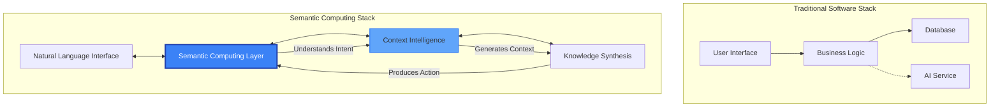
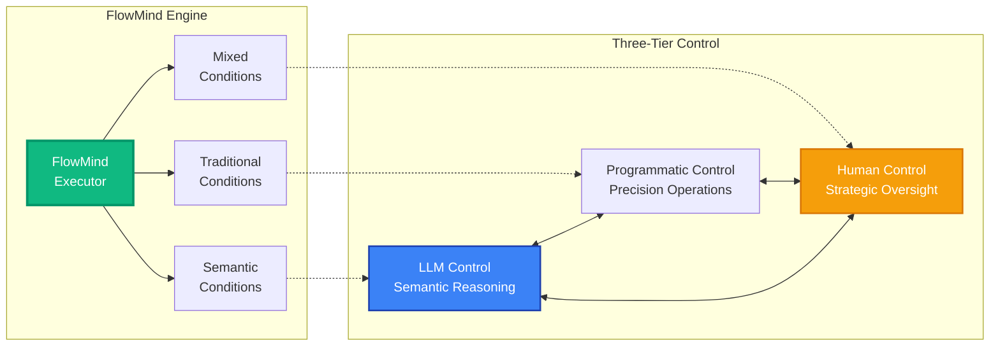
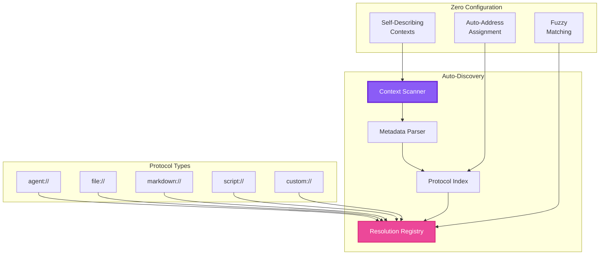
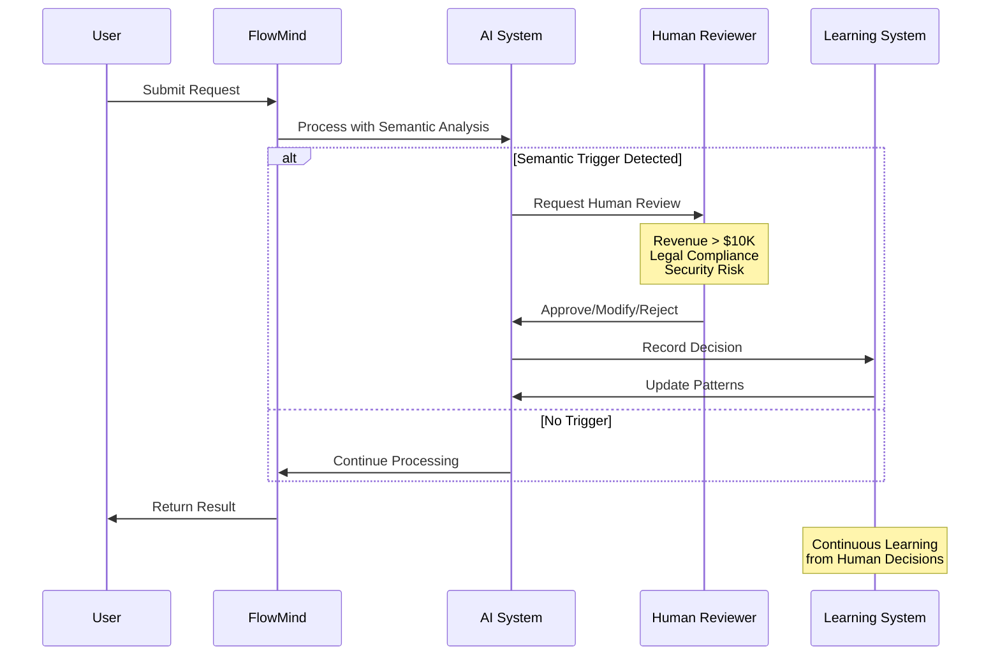
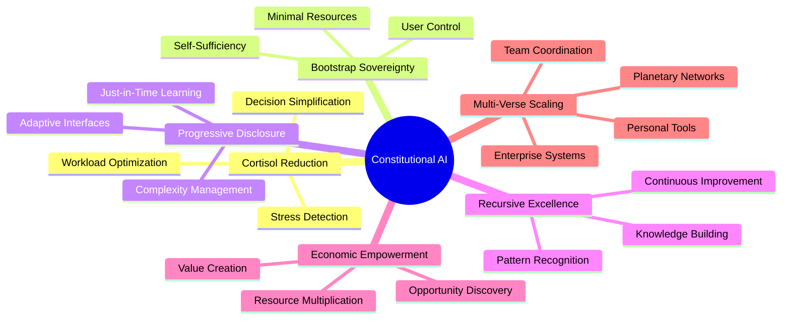
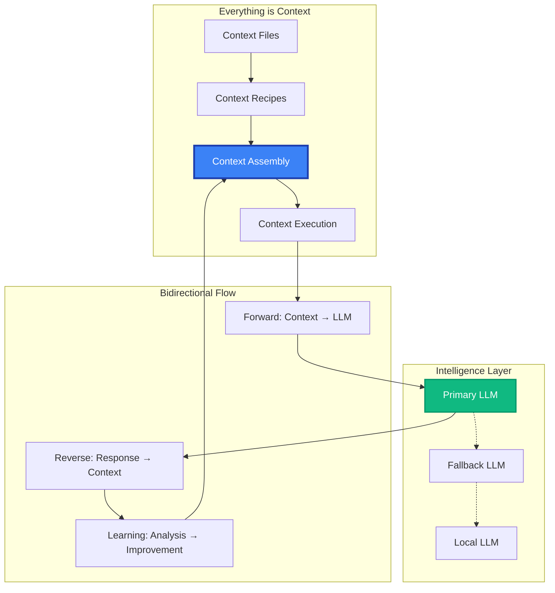
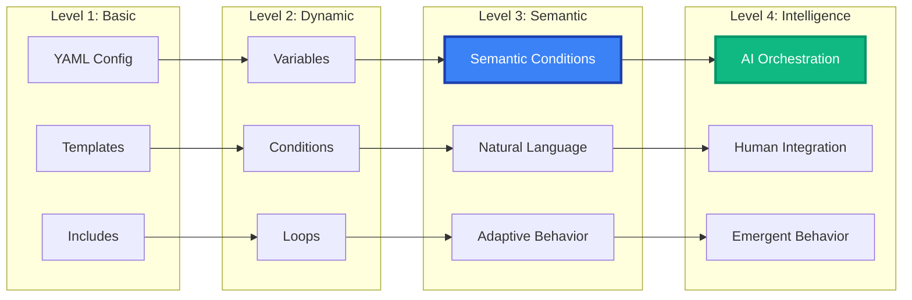

# Visual Diagrams for The Semantic Computing Revolution

## 1. Semantic Computing Architecture Overview



## 2. FlowMind Control Flow Architecture



## 3. Protocol-Based Discovery System



## 4. Human-in-the-Loop Intelligence Flow



## 5. Constitutional Framework Integration



## 6. LLM-First Architecture Pattern



## 7. Enterprise Transformation Journey

```mermaid
journey
    title Enterprise AI Transformation with MCP-CEO
    
    section Current State
      Decision Committees: 3: CEO, CTO, CFO
      Email Overload: 2: Everyone
      Meeting Fatigue: 1: Leadership
      
    section Phase 1: Foundation
      Deploy AI Council: 5: Tech Team
      Pilot Project: 4: Innovation Team
      Measure ROI: 5: Finance
      
    section Phase 2: Expansion
      Department Rollout: 6: All Teams
      Process Automation: 7: Operations
      Stress Reduction: 8: HR
      
    section Phase 3: Transformation
      Strategic AI: 8: Executive
      Culture Shift: 7: Organization
      Competitive Edge: 9: Market
      
    section Future State
      Semantic Organization: 9: Everyone
      Self-Optimizing: 9: Systems
      Human Flourishing: 10: Culture
```

## 8. FlowMind Evolution Path



## Usage Instructions

These diagrams can be rendered using:
1. **Mermaid Live Editor**: https://mermaid.live/
2. **GitHub**: Automatically renders in markdown files
3. **VS Code**: With Mermaid extension
4. **Web Integration**: Using mermaid.js library

To include in the book:
- PDF: Export as SVG/PNG from Mermaid Live
- Web: Include mermaid.js and render dynamically
- Print: High-resolution exports for quality