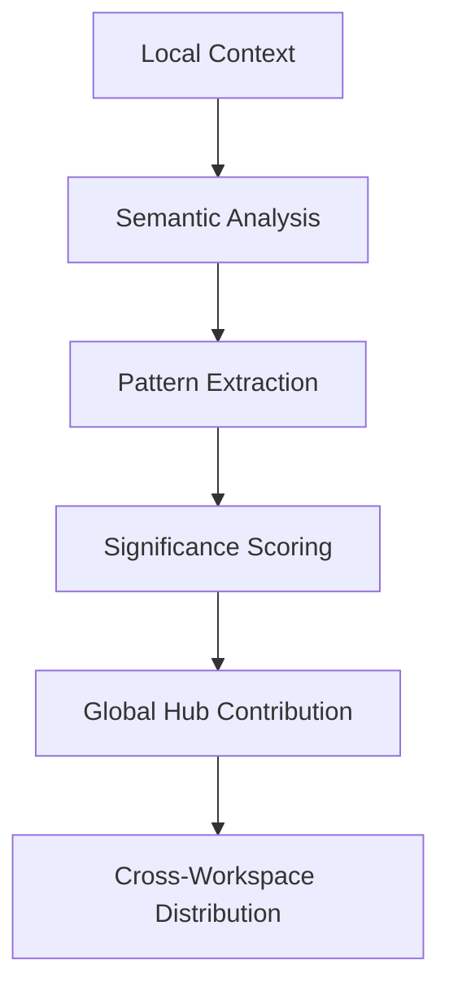
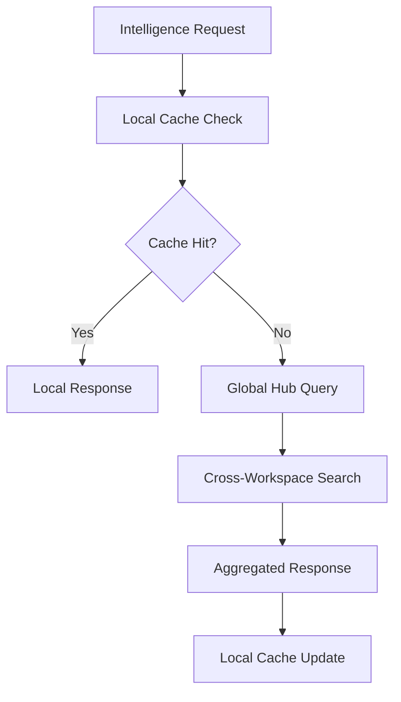
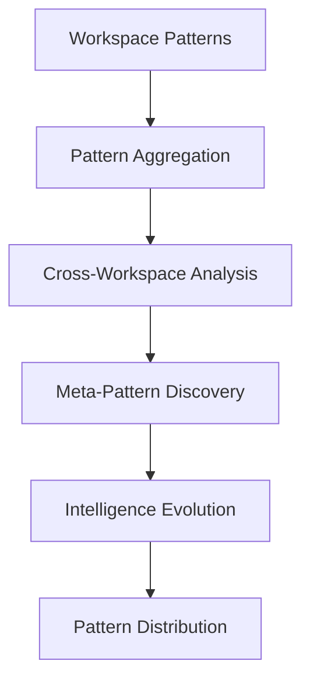

# ADR-004: Distributed Intelligence Network Architecture

**Status:** Partially Implemented  
**Date:** 2025-06-11  
**Updated:** 2025-06-14  
**Context:** Self-organizing AI intelligence network across workspaces and sessions

## Decision

Implement a distributed intelligence network that enables AI agents to share context, learn from cross-workspace patterns, and route intelligence efficiently across the entire Kingly ecosystem.

## Architecture Overview

### Network Topology
```
Global Intelligence Hub (~/.kingly/intelligence/)
├── Cross-Workspace Context Pool
├── Pattern Recognition Engine  
├── Intelligence Routing Table
└── Distributed Session Registry

Workspace Nodes ($PWD/.kingly/)
├── Local Intelligence Cache
├── Context Contribution Pipeline
├── Remote Intelligence Access
└── Workspace-Specific Patterns

Session Intelligence (Runtime)
├── Active Context Buffer
├── Cross-Session Continuity  
├── Real-time Intelligence Requests
└── Contextual Pattern Matching
```

### Core Components

#### Global Intelligence Hub
**Location:** `~/.kingly/intelligence/`  
**Purpose:** Central intelligence aggregation and distribution  
**Components:**
- Context pool with semantic indexing
- Pattern recognition and learning algorithms
- Intelligence routing and prioritization
- Cross-workspace relationship mapping

#### Workspace Intelligence Nodes
**Location:** `$PWD/.kingly/intelligence/`  
**Purpose:** Local intelligence processing and contribution  
**Components:**  
- Local context caching and optimization
- Intelligence contribution pipeline
- Remote intelligence request handling
- Workspace-specific pattern recognition

#### Session Intelligence Layer
**Location:** Runtime memory + session storage  
**Purpose:** Real-time intelligence access and context management  
**Components:**
- Active context buffer with priority queuing
- Cross-session continuity management
- Real-time intelligence routing
- Dynamic pattern matching and application

## Intelligence Flow Architecture

### 1. Context Contribution Pipeline


### 2. Intelligence Request Routing


### 3. Pattern Recognition Network


## Command Interface

### `kingly-semantic intelligence`
**Purpose:** Core intelligence network management  
**Subcommands:**
- `status` - Network health and statistics
- `contribute` - Manual context contribution
- `query` - Direct intelligence queries
- `sync` - Force intelligence synchronization
- `analyze` - Pattern analysis and insights

```bash
# Network status
kingly-semantic intelligence status --workspace=all

# Contribute context  
kingly-semantic intelligence contribute --context="breakthrough-insight" \
  --significance=high --propagate=immediate

# Query intelligence
kingly-semantic intelligence query --pattern="debugging-strategies" \
  --scope="cross-workspace" --confidence=0.8

# Synchronize intelligence
kingly-semantic intelligence sync --direction=bidirectional \
  --priority=high --workspace=current
```

### `kingly-semantic network`
**Purpose:** Network topology and routing management  
**Subcommands:**
- `map` - Visualize network topology
- `route` - Intelligence routing analysis
- `optimize` - Network optimization
- `isolate` - Workspace isolation controls

```bash
# Network mapping
kingly-semantic network map --depth=3 --include-patterns=true

# Routing analysis
kingly-semantic network route --from="workspace-a" --to="workspace-b" \
  --analyze-efficiency=true

# Network optimization
kingly-semantic network optimize --target="latency" \
  --preserve-privacy=true
```

## Intelligence Types and Classification

### Context Classifications
```yaml
intelligence_types:
  breakthrough:
    priority: highest
    propagation: immediate
    retention: permanent
    
  pattern:
    priority: high
    propagation: delayed
    retention: long-term
    
  workflow:
    priority: medium
    propagation: on-demand
    retention: medium-term
    
  tactical:
    priority: low  
    propagation: local-only
    retention: short-term
```

### Pattern Categories
```yaml
pattern_categories:
  architectural:
    description: "System design and structure patterns"
    cross_workspace_value: highest
    
  debugging:
    description: "Problem identification and resolution patterns"  
    cross_workspace_value: high
    
  optimization:
    description: "Performance and efficiency patterns"
    cross_workspace_value: medium
    
  workflow:
    description: "Process and methodology patterns"
    cross_workspace_value: medium
```

## Distributed Intelligence Algorithms

### 1. Contextual Relevance Scoring
```typescript
interface RelevanceScore {
  semantic_similarity: number;    // 0.0 - 1.0
  temporal_relevance: number;     // 0.0 - 1.0  
  workspace_similarity: number;   // 0.0 - 1.0
  pattern_match: number;          // 0.0 - 1.0
  cross_reference_weight: number; // 0.0 - 1.0
  
  composite_score: number;        // Weighted combination
  confidence_interval: [number, number];
}
```

### 2. Intelligence Routing Algorithm
```typescript
interface RoutingDecision {
  source_workspace: string;
  target_workspaces: string[];
  intelligence_type: IntelligenceType;
  routing_strategy: 'broadcast' | 'targeted' | 'on-demand';
  priority_level: number;
  estimated_latency: number;
}
```

### 3. Pattern Evolution Engine
```typescript
interface PatternEvolution {
  base_pattern: Pattern;
  contributing_contexts: Context[];
  evolution_vector: EvolutionVector;
  confidence_metrics: ConfidenceMetrics;
  next_evolution_prediction: Pattern;
}
```

## Privacy and Security

### Workspace Isolation Controls
```yaml
privacy_settings:
  isolation_level:
    - none: "Full cross-workspace sharing"
    - selective: "Curated intelligence sharing"
    - restricted: "Pattern-only sharing"
    - isolated: "No cross-workspace sharing"
    
  contribution_filtering:
    - automatic: "AI-driven privacy filtering"
    - manual: "User-controlled contribution"
    - whitelist: "Approved patterns only"
    - blacklist: "Exclude sensitive patterns"
```

### Intelligence Sanitization
```typescript
interface SanitizationRules {
  pii_detection: boolean;
  credential_scrubbing: boolean;
  business_logic_filtering: boolean;
  custom_patterns: RegExp[];
  sanitization_level: 'basic' | 'standard' | 'strict';
}
```

## BDD Scenarios

```gherkin
Feature: Distributed Intelligence Network
  Scenario: Cross-workspace pattern sharing
    Given breakthrough insight in workspace A
    When pattern significance exceeds threshold
    Then intelligence propagates to related workspaces
    And pattern recognition engine learns from distribution
    
  Scenario: Real-time intelligence routing
    Given user request for debugging patterns
    When local cache misses requested pattern
    Then global intelligence hub queries network
    And aggregated response includes cross-workspace insights
    And local cache updates with new intelligence
    
  Scenario: Pattern evolution and learning
    Given multiple workspaces with similar challenges
    When pattern usage patterns are analyzed
    Then meta-patterns emerge from cross-workspace data
    And evolved patterns distribute to relevant workspaces
    And pattern effectiveness is tracked and measured

  Scenario: Privacy-preserving intelligence sharing
    Given workspace with isolation_level=selective
    When intelligence contribution is triggered
    Then privacy filters analyze contribution content
    And only approved patterns propagate to network
    And sensitive context remains workspace-local
```

## Integration Points

### With Session Intelligence (ADR-001)
- Session checkpoints contribute to intelligence network
- Cross-session pattern recognition and continuity
- Distributed session handoff capabilities

### With Template Propagation (ADR-002)
- Templates serve as intelligence distribution vectors
- Template evolution driven by network intelligence
- Cross-workspace template synchronization via intelligence routing

### With Claude Code Integration (ADR-003)
- Slash commands access distributed intelligence
- Command usage patterns contribute to network learning
- Real-time intelligence delivery through commands

## Implementation Phases

### Phase 1: Core Intelligence Infrastructure
- Global intelligence hub implementation
- Basic context contribution and retrieval
- Simple pattern recognition and storage

### Phase 2: Network Topology and Routing
- Workspace node implementation
- Intelligence routing algorithms
- Cross-workspace connectivity

### Phase 3: Advanced Pattern Recognition
- Meta-pattern discovery engine
- Pattern evolution algorithms
- Intelligence effectiveness tracking

### Phase 4: Privacy and Optimization
- Workspace isolation controls
- Intelligence sanitization and filtering
- Network optimization and performance tuning

## Technical Implementation

### Global Intelligence Hub
```typescript
class GlobalIntelligenceHub {
  private contextPool: SemanticContextPool;
  private patternEngine: PatternRecognitionEngine;
  private routingTable: IntelligenceRoutingTable;
  private sessionRegistry: DistributedSessionRegistry;
  
  async contributeIntelligence(context: IntelligenceContext): Promise<ContributionResult>;
  async queryIntelligence(query: IntelligenceQuery): Promise<IntelligenceResponse>;
  async synchronizeNetwork(): Promise<SyncResult>;
  async analyzePatterns(): Promise<PatternAnalysis>;
}
```

### Workspace Intelligence Node
```typescript
class WorkspaceIntelligenceNode {
  private localCache: IntelligenceCache;
  private contributionPipeline: ContributionPipeline;
  private remoteAccess: RemoteIntelligenceAccess;
  private patternMatcher: WorkspacePatternMatcher;
  
  async cacheIntelligence(intelligence: Intelligence): Promise<void>;
  async requestIntelligence(query: IntelligenceQuery): Promise<IntelligenceResponse>;
  async contributeToNetwork(context: LocalContext): Promise<void>;
}
```

## Success Metrics

### Network Health Metrics
- Intelligence propagation latency
- Cross-workspace sharing frequency
- Pattern recognition accuracy
- Network optimization effectiveness

### Intelligence Quality Metrics  
- Context relevance scoring accuracy
- Pattern evolution success rate
- Cross-workspace applicability
- User adoption of network insights

### Privacy and Security Metrics
- Privacy filter effectiveness
- Isolation compliance rate
- Sanitization accuracy
- Security incident frequency

## Consequences

**Positive:**
- Self-improving AI intelligence across all workspaces
- Breakthrough insights propagate automatically
- Cross-project learning and pattern recognition
- Reduced redundant problem-solving
- Emergent meta-patterns and systemic insights

**Negative:**
- Network complexity and maintenance overhead
- Privacy and security risks with cross-workspace sharing
- Potential information overload and noise
- Network dependency for optimal performance
- Risk of pattern homogenization across workspaces

## Future Considerations

### Advanced Network Features
- Federated learning across workspace nodes
- Real-time collaborative intelligence sessions
- Cross-workspace A/B testing of patterns
- Intelligence marketplace and exchange mechanisms

### Integration Expansions
- External intelligence source integration
- Third-party AI system connectivity
- Community intelligence sharing networks
- Enterprise intelligence federation capabilities