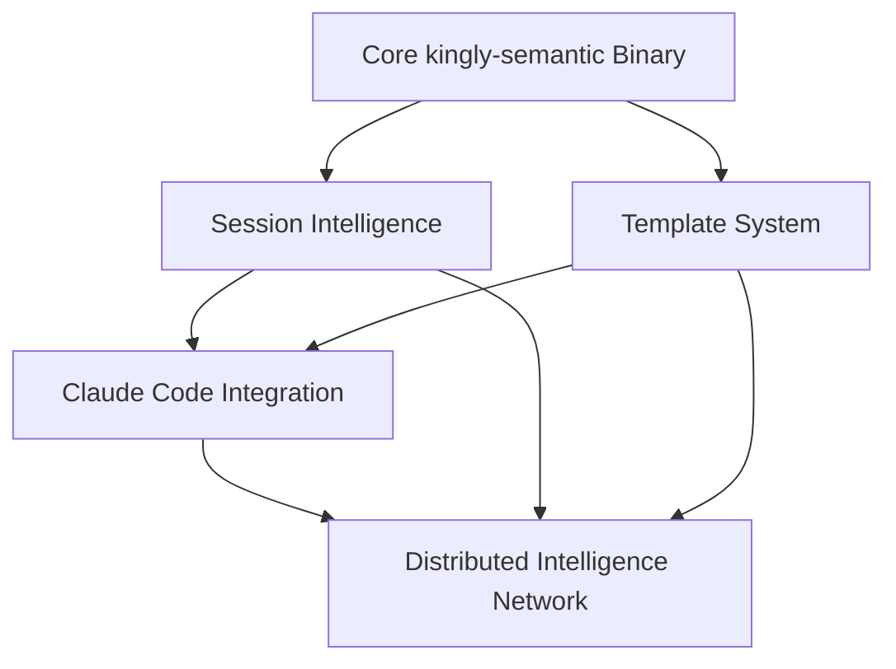

# ADR-005: Implementation Roadmap & Integration Strategy

**Status:** In Progress  
**Date:** 2025-06-11  
**Updated:** 2025-06-14  
**Context:** Coordinated implementation of distributed AI workspace intelligence system

## Decision

Define comprehensive implementation roadmap that coordinates all system components (Session Intelligence, Template Propagation, Claude Code Integration, Distributed Intelligence Network) into a cohesive, incrementally deployable system.

## Implementation Strategy

### Dependency Graph


### Phase-Gate Approach

#### Phase 1: Foundation (Weeks 1-2)
**Goal:** Establish core infrastructure and basic functionality  
**Success Criteria:** Basic kingly-semantic commands working, session management functional

**Phase 1A: Core Infrastructure**
- Enhance kingly-semantic binary with new command structure
- Implement basic session storage in `~/.kingly/sessions/`
- Create foundational template system
- Establish workspace detection and context loading

**Phase 1B: Basic Session Management**  
- Implement `ping`, `handoff`, `load` commands
- Create session checkpoint system
- Basic context serialization and restoration
- File reference tracking and validation

**Deliverables:**
- ✅ Working kingly-semantic binary with session commands
- ✅ Session storage and retrieval system
- ✅ Basic workspace context detection
- ✅ Foundational template structure

#### Phase 2: Claude Code Integration (Weeks 3-4)
**Goal:** Seamless Claude Code slash command integration  
**Success Criteria:** All slash commands working with backend intelligence

**Phase 2A: MCP Enhancement**
- Extend existing MCP server with new intelligence tools
- Implement slash command to backend translation
- Create structured response formatting
- Error handling and fallback mechanisms

**Phase 2B: Command Implementation**
- `/think` command with auto-save capability
- `/all` comprehensive intelligence dump  
- `/kingly` interactive workflow selection
- `/exec` workflow execution with progress tracking

**Deliverables:**
- ✅ Enhanced MCP server with intelligence tools
- ✅ Working slash commands in Claude Code
- ✅ Structured response format
- ✅ Error handling and user feedback

#### Phase 3: Template Propagation (Weeks 5-6)
**Goal:** Self-propagating AI-optimized documentation system  
**Success Criteria:** Templates auto-sync and evolve across workspaces

**Phase 3A: Template Engine**
- Template initialization and synchronization system
- Variable substitution and context awareness
- Cross-workspace template inheritance
- Template versioning and conflict resolution

**Phase 3B: AI-Driven Evolution**
- Usage pattern analysis and template improvement
- AI-driven template evolution algorithms
- Template effectiveness tracking
- Cross-workspace template propagation

**Deliverables:**
- ✅ Working template system with sync capabilities
- ✅ AI-driven template evolution engine
- ✅ Cross-workspace template propagation
- ✅ Template effectiveness metrics

#### Phase 4: Distributed Intelligence Network (Weeks 7-8)
**Goal:** Self-organizing intelligence sharing across workspaces  
**Success Criteria:** Cross-workspace intelligence routing and pattern sharing

**Phase 4A: Intelligence Infrastructure**
- Global intelligence hub implementation
- Workspace intelligence nodes
- Basic intelligence contribution and retrieval
- Cross-workspace connectivity

**Phase 4B: Advanced Intelligence Features**  
- Pattern recognition and evolution engine
- Intelligence routing optimization
- Privacy controls and sanitization
- Network health monitoring

**Deliverables:**
- ✅ Global intelligence hub with workspace nodes
- ✅ Cross-workspace intelligence sharing
- ✅ Pattern recognition and evolution
- ✅ Privacy and security controls

## Technical Implementation Plan

### Core Binary Enhancement
```bash
# New command structure for kingly-semantic
kingly-semantic/
├── commands/
│   ├── session/     # ping, handoff, load
│   ├── template/    # init, sync, evolve  
│   ├── intelligence/ # status, contribute, query
│   ├── network/     # map, route, optimize
│   └── workflow/    # select, execute, chain
├── core/
│   ├── context/     # Context loading and management
│   ├── storage/     # Session and intelligence storage
│   ├── routing/     # Cross-workspace routing
│   └── patterns/    # Pattern recognition engine
└── integrations/
    ├── claude-code/ # MCP integration
    ├── templates/   # Template system integration
    └── intelligence/ # Network intelligence integration
```

### MCP Server Enhancement
```typescript
// Enhanced MCP tools for Claude Code integration
const mcpTools = {
  // Session management
  'session_ping': createTool('session_ping', pingSessionHandler),
  'session_handoff': createTool('session_handoff', handoffHandler),
  'session_load': createTool('session_load', loadHandler),
  
  // Intelligence access
  'intelligence_power': createTool('intelligence_power', powerAnalysisHandler),
  'intelligence_lookup': createTool('intelligence_lookup', lookupHandler),
  'intelligence_all': createTool('intelligence_all', comprehensiveHandler),
  
  // Workflow management
  'workflow_select': createTool('workflow_select', workflowSelectHandler),
  'workflow_execute': createTool('workflow_execute', executeHandler),
  
  // Template system
  'template_sync': createTool('template_sync', templateSyncHandler),
  'template_evolve': createTool('template_evolve', evolveHandler),
  
  // Network intelligence
  'network_intelligence': createTool('network_intelligence', networkHandler),
  'network_status': createTool('network_status', statusHandler)
};
```

### Storage Architecture
```
~/.kingly/                          # Global Kingly storage
├── intelligence/                   # Global intelligence hub
│   ├── contexts/                   # Cross-workspace contexts
│   ├── patterns/                   # Recognized patterns
│   ├── routing.json               # Intelligence routing table
│   └── network.json               # Network topology
├── sessions/                       # Cross-workspace sessions
│   ├── YYYY-MM-DD-topic-ID.json   # Session checkpoints
│   └── handoffs/                   # Session handoff packages
├── templates/                      # Global templates
│   ├── CLAUDE.md.template         # Project instruction template
│   ├── README.agent.template      # Agent-first README
│   └── ADR.template              # Architecture decision template
└── config/                        # Global configuration
    ├── intelligence.yaml          # Intelligence network config
    ├── templates.yaml             # Template system config
    └── privacy.yaml               # Privacy and security settings

$PWD/.kingly/                      # Project-specific storage
├── intelligence/                   # Local intelligence cache
│   ├── cache/                     # Local intelligence cache
│   ├── contributions/             # Pending contributions
│   └── patterns/                  # Workspace-specific patterns
├── sessions/                       # Project-specific sessions
│   └── current/                   # Active session data
├── templates/                      # Local template overrides
│   └── local.*.template           # Project-specific templates
└── config/                        # Project configuration
    ├── workspace.yaml             # Workspace configuration
    ├── intelligence.yaml          # Local intelligence settings
    └── privacy.yaml               # Project privacy settings
```

## Integration Testing Strategy

### Test Pyramid
```
E2E Integration Tests (Top)
├── Full workflow session → handoff → load cycle
├── Cross-workspace intelligence sharing
├── Template propagation and evolution
└── Claude Code slash command integration

Integration Tests (Middle)  
├── kingly-semantic command integration
├── MCP server tool integration
├── Storage system integration
└── Cross-component data flow

Unit Tests (Bottom)
├── Individual command implementations
├── Storage layer operations
├── Pattern recognition algorithms
└── Template system components
```

### BDD Scenarios Coverage
```gherkin
# End-to-End Integration
Feature: Complete Intelligence Workflow
  Scenario: Full session lifecycle with intelligence sharing
    Given workspace A with active session and breakthrough insight
    When session handoff is triggered with cross-workspace propagation
    Then insight propagates to related workspaces via intelligence network
    And template evolution incorporates new patterns
    And new session in workspace B loads with enhanced context
    And Claude Code slash commands access distributed intelligence

# Cross-Component Integration  
Feature: Component Integration
  Scenario: Template evolution drives intelligence network
    Given template system with usage pattern analysis
    When AI-driven evolution identifies improvements
    Then evolved templates propagate via intelligence network
    And related workspaces receive template updates
    And session management incorporates template improvements
```

## Risk Mitigation Strategy

### Technical Risks
| Risk | Impact | Mitigation |
|------|--------|------------|
| kingly-semantic binary complexity | High | Modular command architecture, comprehensive testing |
| MCP integration instability | Medium | Fallback mechanisms, error handling, graceful degradation |
| Cross-workspace data corruption | High | Data validation, backup strategies, rollback capabilities |
| Intelligence network latency | Medium | Local caching, async operations, performance optimization |
| Template conflict resolution | Low | Conflict detection, merge strategies, user override options |

### Product Risks
| Risk | Impact | Mitigation |
|------|--------|------------|
| User adoption resistance | Medium | Gradual rollout, comprehensive documentation, training |
| Privacy concerns | High | Robust privacy controls, transparent data handling, opt-out options |
| System complexity overwhelming users | Medium | Progressive disclosure, sensible defaults, optional advanced features |
| Cross-workspace pollution | Low | Intelligent filtering, relevance scoring, isolation controls |

## Success Metrics and KPIs

### Technical Metrics
- **Command Execution Performance:** <500ms average response time
- **Cross-Workspace Intelligence Accuracy:** >80% relevance score
- **Template Evolution Effectiveness:** >70% user acceptance rate
- **System Reliability:** >99% uptime, <1% error rate
- **Storage Efficiency:** <100MB per workspace average

### User Experience Metrics
- **Slash Command Adoption:** >80% of sessions use slash commands
- **Cross-Workspace Intelligence Usage:** >50% of intelligence requests cross workspaces
- **Template Synchronization Frequency:** >60% of workspaces sync templates
- **Session Handoff Success Rate:** >90% successful context restoration
- **User Satisfaction:** >8/10 user experience rating

### Intelligence Network Metrics
- **Pattern Recognition Accuracy:** >75% useful pattern identification
- **Cross-Workspace Learning:** >60% of patterns apply across workspaces
- **Intelligence Network Growth:** >50% monthly intelligence contribution increase
- **Privacy Compliance:** 100% privacy filter effectiveness
- **Network Optimization:** <200ms average intelligence routing latency

## Rollout Strategy

### Beta Phase (Weeks 9-10)
- Internal dogfooding with core development team
- Key feature validation and performance optimization
- Initial user feedback collection and iteration
- System stability and reliability testing

### Limited Release (Weeks 11-12)
- Gradual rollout to selected early adopters
- Comprehensive documentation and training materials
- User onboarding optimization
- Feedback collection and rapid iteration

### General Availability (Week 13+)
- Full feature rollout with complete documentation
- Community support and feedback channels
- Continuous improvement and feature enhancement
- Long-term monitoring and optimization

## Long-term Vision

### Next-Generation Features
- **Federated Intelligence Networks:** Cross-organization intelligence sharing
- **Real-time Collaborative Sessions:** Multi-user distributed sessions
- **AI-AI Communication Protocols:** Direct agent-to-agent intelligence exchange
- **Predictive Intelligence Routing:** Anticipatory context preparation
- **Cross-Platform Integration:** Integration with external AI tools and platforms

### Ecosystem Expansion
- **Community Intelligence Marketplace:** Shared pattern and template ecosystem
- **Enterprise Federation:** Large-scale organizational intelligence networks
- **Third-Party Integrations:** Plugin architecture for external tools
- **Academic Research Integration:** Academic intelligence sharing and research collaboration

## Consequences

**Positive:**
- Revolutionary AI workspace intelligence system
- Self-propagating and evolving AI optimization
- Seamless cross-workspace knowledge sharing
- Dramatic improvement in AI-assisted development workflows
- Foundation for next-generation AI collaboration tools

**Negative:**
- Significant implementation complexity and coordination required
- High initial investment in development and testing
- Potential for system complexity to overwhelm users
- Privacy and security challenges with cross-workspace data sharing
- Risk of creating dependency on centralized intelligence infrastructure

**Mitigation Strategies:**
- Phased rollout with clear success gates
- Comprehensive testing and validation at each phase
- Strong privacy controls and user education
- Fallback mechanisms and graceful degradation
- Continuous monitoring and optimization throughout implementation