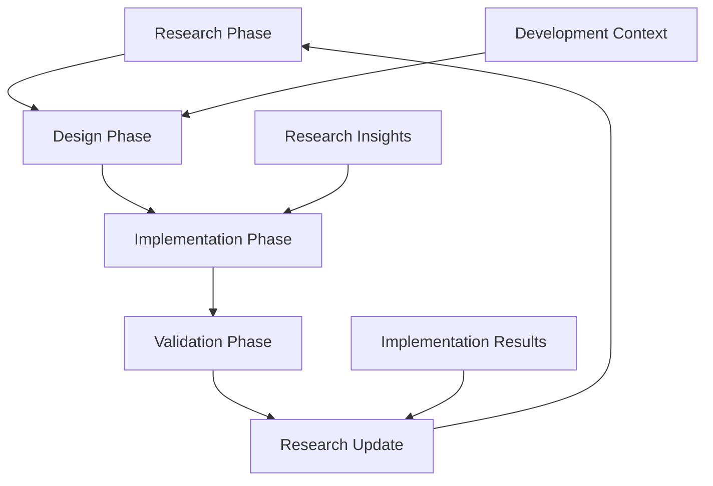

# Research-to-Development Workflow Integration

## 🔗 Dynamic Research Linking System

### 1. Context-Aware Research Injection
```yaml
# Example: When working on MCP integration
current_task: "implement-mcp-kernel-interface"
research_context:
  - foundation/04-mcp-kernel-interface.md
  - architecture/AI-NATIVE-ARCHITECTURE-EXPLAINED.md
  - implementation/PROTOTYPE-FIRST-STRATEGY.md
auto_surface: true
```

### 2. Development Trigger Points
**Code Context → Research Activation:**
- Working on `/kernel/*` → Surface foundation research
- Implementing agents → Load agent architecture docs  
- Writing tests → Reference implementation strategies
- Debugging → Pull troubleshooting patterns

### 3. Bidirectional Workflow Links

#### Research → Code
```bash
# When reading research, auto-suggest implementation
~/research/foundation/01-architecture-fundamentals.md
→ Suggests: Create /kernel/architecture/ stub
→ Links to: Related implementation files
→ Shows: Current dev status for this research area
```

#### Code → Research  
```bash
# When coding, auto-surface relevant research
Working on: /agent/core/context.js
→ Surfaces: foundation/07-memory-management-llm.md
→ Shows: Related patent implications
→ Suggests: Architecture validation checklist
```

### 4. Intelligent Workflow Routing

#### CEO Agent Integration
```javascript
// Auto-route based on development context
if (workingOn.includes('kernel')) {
  surface(['foundation/', 'architecture/'])
  checkPatentImplications()
}

if (workingOn.includes('agent')) {
  surface(['implementation/', 'synthesis/'])  
  suggestTestStrategy()
}
```

#### Session-Aware Research
```bash
# Track research → development progression
Session: 2025-06-12-session-pg20l1
Research_Phase: "foundation/04-mcp-kernel-interface"
Development_Phase: "not_started"
Suggested_Next: "Create kernel/mcp/ directory structure"
```

## 🚀 Implementation Strategy

### Phase 1: Context Detection
- Parse current working directory
- Analyze recent file changes
- Identify development patterns

### Phase 2: Research Mapping
- Match file patterns to research themes
- Surface relevant knowledge graph nodes
- Suggest implementation order

### Phase 3: Workflow Automation
- Auto-create development stubs from research
- Link research citations to code comments
- Generate implementation checklists

### Phase 4: Bidirectional Updates
- Update research when implementation differs
- Flag research gaps during development
- Sync research status with code progress

## 🎯 Practical Examples

### Example 1: MCP Development
```
User works on: /kernel/mcp/interface.js
System surfaces:
  - foundation/04-mcp-kernel-interface.md (design)
  - patents/COMPLETE_PATENT_APPLICATION_USPTO.md (IP considerations)
  - implementation/PROTOTYPE-FIRST-STRATEGY.md (approach)
Auto-suggests: "Implement zero-config protocol discovery first"
```

### Example 2: Agent Architecture
```
User reads: foundation/01-architecture-fundamentals.md  
System suggests:
  - Create /agent/architecture/ directory
  - Implement universal context pattern
  - Add agent coordination tests
Next action: "Start with context.js based on research insights"
```

### Example 3: Research Gap Discovery
```
User implements: New agent communication protocol
System detects: No research coverage for this pattern
Auto-creates: research/gaps/agent-communication-protocol.md
Suggests: "Research this pattern before full implementation"
```

## 🔧 Technical Implementation

### File System Watchers
- Monitor `/research` for new insights
- Watch development directories for progress
- Trigger research surfacing on file access

### Embedding Integration  
- Generate embeddings for research content
- Match development context to research vectors
- Provide similarity-based suggestions

### CEO Agent Hooks
- Research context in all agent sessions
- Development progress tracking
- Cross-session research continuity

### Workflow State Machine
