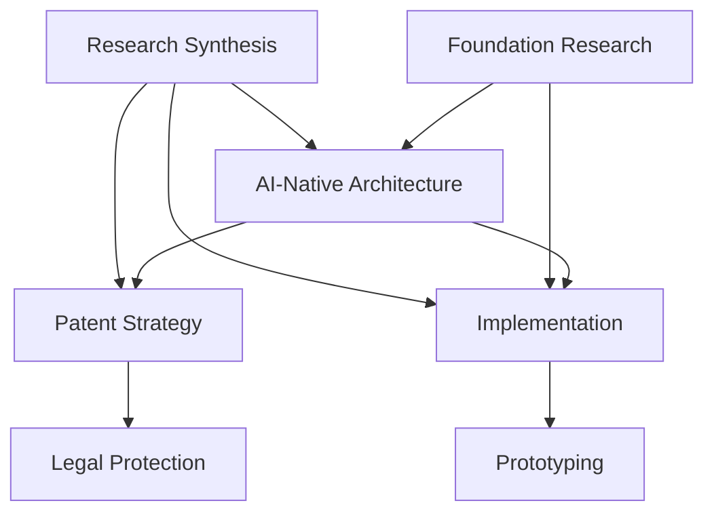

# Kingly OS Research Knowledge Graph

## Core Research Themes

### 1. AI-Native Architecture
**Files:** AI-NATIVE-ARCHITECTURE-EXPLAINED.md, AI-OS-FEASIBILITY-ANALYSIS.md
**Connections:** → Patent Strategy → Implementation Prompts
**Key Concepts:** Zero-static-prompt, LLM-first design, embedded AI

### 2. Patent & IP Strategy  
**Files:** COMPLETE_PATENT_APPLICATION_USPTO.md, KINGLY_OS_PATENT_STRATEGY.md, PATENT_FILING_GUIDE.md
**Connections:** → Architecture → Legal Protection
**Key Concepts:** USPTO filing, technical drawings, IP protection

### 3. Implementation Strategy
**Files:** IMPLEMENTATION-PROMPTS-ELI5.md, PROTOTYPE-FIRST-STRATEGY.md, PYTHON-PROTOTYPE-STRATEGY.md
**Connections:** → Architecture → Language Selection
**Key Concepts:** Rapid prototyping, ELI5 methodology, development workflow

### 4. Research & Analysis
**Files:** FINAL_RESEARCH_SUMMARY.md, RESEARCH_EXECUTION_PLAN.md, MASTER-ELI5-INSIGHTS.md
**Connections:** → All themes (meta-research)
**Key Concepts:** Research synthesis, execution planning, insight aggregation

### 5. Foundation Research (kingly-os-research/)
**Subdirectory:** foundation/ (21 core topics)
**Connections:** → Architecture → Implementation
**Key Concepts:** Embedded LLM, minimal Linux, MCP integration, security

## Semantic Relationships



## Cross-References

### Architecture ↔ Implementation
- AI-NATIVE-ARCHITECTURE-EXPLAINED.md → IMPLEMENTATION-PROMPTS-ELI5.md
- foundation/01-architecture-fundamentals.md → PROTOTYPE-FIRST-STRATEGY.md

### Research ↔ Patent
- FINAL_RESEARCH_SUMMARY.md → COMPLETE_PATENT_APPLICATION_USPTO.md
- foundation/ research → patent_sections/

### Strategy ↔ Execution  
- KINGLY_OS_PROJECT_BRIEF.md → RESEARCH_EXECUTION_PLAN.md
- MASTER-ELI5-INSIGHTS.md → PYTHON-PROTOTYPE-STRATEGY.md

## Knowledge Clusters

1. **Core Theory:** Architecture + Foundation research
2. **Legal Strategy:** Patents + IP protection  
3. **Execution:** Implementation + Prototyping
4. **Meta-Research:** Analysis + Synthesis + Planning

## Research Lineage

```
Initial Concept → Foundation Research → Architecture Design → Patent Filing → Implementation Strategy → Prototype Development
```