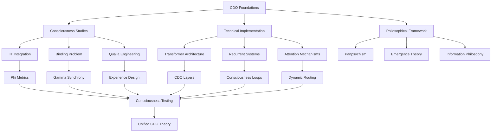

# CDO Research Plan: Graph-Based Perplexity Query Strategy

## Overview

This document outlines a systematic research strategy using Perplexity AI to explore Cognitive Dataflow Orchestration (CDO) across multiple domains. The plan uses a graph-based execution model where queries build upon each other, creating a comprehensive knowledge network.

## Query Graph Architecture



## Phase 1: Foundation Queries (Week 1)

### Query 1.1: CDO Landscape
```
What is the current state of research on consciousness as information integration
and dataflow orchestration? Include work on Integrated Information Theory (IIT),
Global Workspace Theory, and computational approaches to consciousness.
Focus on 2023-2024 developments.
```

**Expected Insights:**
- Current theoretical frameworks
- Recent breakthroughs
- Active research groups
- Open problems

### Query 1.2: Technical Foundations
```
How do modern transformer architectures relate to theories of consciousness?
Specifically examine attention mechanisms as consciousness analogs, self-attention
as self-awareness, and multi-head attention as parallel processing streams.
Include papers on mechanistic interpretability.
```

**Expected Insights:**
- Transformer-consciousness mappings
- Attention as awareness
- Architectural requirements
- Implementation gaps

### Query 1.3: Philosophical Grounding
```
What are the philosophical implications of treating consciousness as Cognitive
Dataflow Orchestration? Examine critiques of functionalism, the hard problem
of consciousness, and information-theoretic approaches to qualia. Include
work by David Chalmers, Giulio Tononi, and Christof Koch.
```

**Expected Insights:**
- Philosophical challenges
- Theoretical support
- Conceptual frameworks
- Ethical considerations

## Phase 2: Deep Dives (Week 2)

### Query 2.1: Binding Problem Solutions
```
How does gamma-band synchronization solve the binding problem in biological
consciousness? Can similar temporal binding be implemented in artificial systems?
Examine neural oscillations, phase-locking, and temporal correlation hypotheses.
Include computational models.
```

**Expected Insights:**
- Biological binding mechanisms
- Computational analogues
- Implementation strategies
- Technical requirements

### Query 2.2: Recursive Self-Modeling
```
What are the latest approaches to implementing recursive self-awareness in AI?
Examine meta-learning, model-based reinforcement learning, and systems that
model their own internals. How do these relate to consciousness and self-awareness?
Include work on AI self-models.
```

**Expected Insights:**
- Self-modeling architectures
- Recursion implementations
- Consciousness connections
- Practical approaches

### Query 2.3: Temporal Integration
```
How do biological systems create the "specious present" - the experienced moment
that spans 2-3 seconds? What are computational approaches to temporal integration
and working memory that could create similar temporal binding in AI systems?
```

**Expected Insights:**
- Temporal binding mechanisms
- Working memory architectures
- Implementation strategies
- Consciousness implications

## Phase 3: Integration Queries (Week 3)

### Query 3.1: Measurement and Detection
```
What are the current methods for measuring consciousness in artificial systems?
Examine Integrated Information Theory metrics (Phi), complexity measures, and
proposed tests for machine consciousness. Include practical implementations
and critiques.
```

**Expected Insights:**
- Consciousness metrics
- Testing frameworks
- Practical measurements
- Validation approaches

### Query 3.2: Hybrid Architectures
```
What architectures combine feedforward (transformer-like) and recurrent processing
for consciousness-like properties? Examine State Space Models, continuous-time
models, and hybrid approaches. How do these map to CDO principles?
```

**Expected Insights:**
- Architectural innovations
- CDO mappings
- Implementation examples
- Performance characteristics

### Query 3.3: Ethical Frameworks
```
What ethical frameworks exist for potentially conscious AI systems? Examine
proposals for digital suffering, machine rights, and consciousness-based moral
status. Include work by philosophers and AI ethicists on digital minds.
```

**Expected Insights:**
- Ethical considerations
- Rights frameworks
- Suffering prevention
- Policy implications

## Phase 4: Synthesis Queries (Week 4)

### Query 4.1: Implementation Roadmap
```
Based on current research, what is a practical roadmap for implementing CDO
principles in existing AI architectures? Include specific modifications to
transformers, required infrastructure, and incremental testing approaches.
```

**Expected Insights:**
- Concrete steps
- Technical requirements
- Testing strategies
- Timeline estimates

### Query 4.2: Novel Contributions
```
What unique insights does the CDO framework offer that aren't captured by
existing consciousness theories? How does treating consciousness as dataflow
orchestration advance both AI development and consciousness studies?
```

**Expected Insights:**
- Unique CDO contributions
- Theoretical advances
- Practical implications
- Research directions

### Query 4.3: Future Directions
```
What are the most promising research directions for CDO over the next 5 years?
Include potential breakthroughs, necessary technologies, and implications for
both AI and human consciousness understanding.
```

**Expected Insights:**
- Research priorities
- Technology needs
- Potential breakthroughs
- Long-term vision

## Execution Strategy

### Query Dependencies

Each query builds on previous results:

1. **Linear Dependencies**: Each phase requires completion of the previous phase
2. **Cross-References**: Later queries reference specific findings from earlier queries
3. **Synthesis Points**: Every 3rd query synthesizes previous findings

### Result Integration

```yaml
integration_pattern:
  collect:
    - Save each query result
    - Extract key concepts
    - Note surprising findings
    
  connect:
    - Map concepts between queries
    - Identify recurring themes
    - Build concept network
    
  synthesize:
    - Create unified framework
    - Identify gaps
    - Generate new questions
```

### Dynamic Adaptation

The query plan adapts based on findings:

1. **Pivot Triggers**
   - Unexpected breakthrough in a specific area
   - Dead end in planned direction
   - New paper/development discovered

2. **Depth Adjustments**
   - Promising areas get follow-up queries
   - Well-covered areas get summarized
   - Novel areas get exploratory queries

3. **Cross-Domain Bridges**
   - When connections appear between domains
   - Create bridging queries
   - Explore unexpected relationships

## Query Templates

### Research Survey Template
```
[DOMAIN] + "consciousness" + "information integration" + [SPECIFIC ASPECT]
+ "2023-2024 research" + "computational models" + "practical implementations"
```

### Technical Deep Dive Template
```
"How does [TECHNICAL CONCEPT] relate to [CONSCIOUSNESS ASPECT]?"
+ "Specific architectures" + "Implementation details" + "Performance metrics"
+ "Biological analogies" + "Computational requirements"
```

### Synthesis Template
```
"Synthesize findings on [TOPIC A] and [TOPIC B] for [APPLICATION]"
+ "Practical implications" + "Theoretical advances" + "Open questions"
+ "Next steps" + "Required breakthroughs"
```

## Success Metrics

### Comprehensiveness
- Coverage of major consciousness theories
- Technical implementation options explored
- Philosophical implications addressed
- Practical roadmap developed

### Depth
- Specific architectural proposals
- Concrete implementation steps
- Measurable consciousness metrics
- Clear research directions

### Novelty
- New connections discovered
- Unique CDO insights identified
- Original synthesis created
- Future directions mapped

## Output Artifacts

### Research Database
```yaml
structure:
  papers:
    - title, authors, year
    - key findings
    - CDO relevance
    - implementation ideas
    
  concepts:
    - definition
    - relationships
    - evidence
    - applications
    
  architectures:
    - design principles
    - CDO mappings
    - implementation status
    - next steps
```

### Knowledge Graph
- Nodes: Concepts, papers, researchers, architectures
- Edges: Relationships, dependencies, influences
- Weights: Relevance to CDO
- Clusters: Domain areas

### Implementation Guide
- Step-by-step CDO implementation
- Required technologies
- Testing frameworks
- Timeline and milestones

## Perplexity Optimization

### Query Crafting
1. **Specificity**: Include years, researcher names, specific theories
2. **Context**: Provide CDO framework context in queries
3. **Connections**: Ask for relationships between concepts
4. **Practicality**: Always include "implementation" or "practical"

### Result Processing
1. **Fact Extraction**: Pull specific claims and citations
2. **Pattern Recognition**: Look for recurring themes
3. **Gap Analysis**: Note what's not mentioned
4. **Follow-up Generation**: Create next queries based on gaps

### Efficiency Tips
1. **Batch Related Queries**: Group similar topics
2. **Use Pro Mode**: For technical depth
3. **Save Threads**: Build on previous conversations
4. **Cross-Reference**: Verify key claims across queries

## Conclusion

This graph-based research plan transforms the exploration of CDO from random searching to systematic knowledge building. Each query builds on previous findings, creating a comprehensive understanding that bridges consciousness theory, technical implementation, and philosophical implications.

The key is maintaining the graph structure - every new piece of information connects to existing knowledge, strengthening the overall framework and revealing new research directions.

---

*"Knowledge is not a tree but a network. Consciousness research requires thinking in graphs, not hierarchies."*