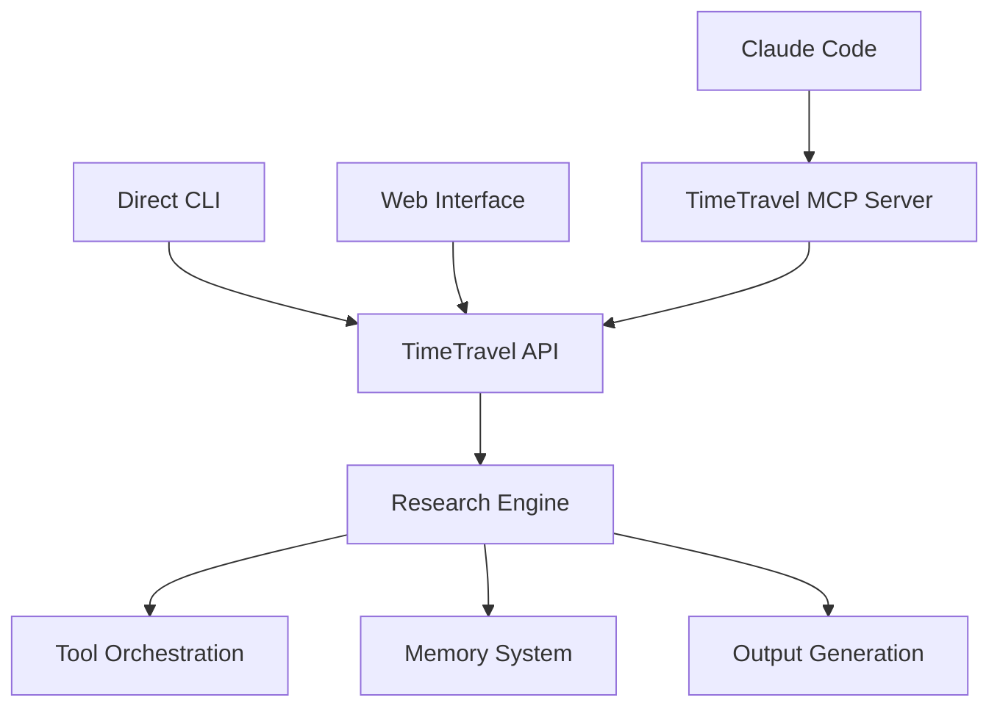

# ADR-001: CLI-First → MCP Wrapper Development Strategy

## Status
**ACCEPTED** - 2025-06-14

## Context

TimeTravel research platform needs to support both direct CLI/API access and Claude Code integration via MCP (Model Context Protocol). We must decide on the architectural approach for this dual-access pattern.

## Decision

We will implement a **CLI-First → MCP Wrapper** strategy with three phases:

### Phase 1: CLI/API Foundation ✅ (Current)
- Build robust CLI and API layer first
- Establish research engine and data flows
- Validate core functionality independently
- Create web interface for human interaction

### Phase 2: MCP Wrapper Layer 🔄 (Next)
- Create MCP server that wraps existing CLI/API
- Expose CLI commands as MCP tools
- Add MCP resource providers for research outputs
- Enable Claude Code integration

### Phase 3: Hybrid Access 🎯 (Goal)
- Support both direct access and MCP access
- Maintain feature parity between access methods
- Allow for independent development and testing

## Architecture



## Rationale

### Why CLI-First?
1. **Independence**: CLI works without MCP infrastructure
2. **Testing**: Easier to test and debug core functionality
3. **Flexibility**: Can be used in scripts, CI/CD, automation
4. **Development Speed**: Faster iteration without MCP complexity

### Why MCP Wrapper?
1. **Claude Code Integration**: Enables AI assistant access
2. **Protocol Compliance**: Follows MCP standards
3. **Resource Sharing**: Exposes research outputs as resources
4. **Tool Discovery**: Claude can discover research capabilities

### Why Not MCP-First?
1. **Complexity**: MCP adds protocol overhead during development
2. **Dependencies**: Requires MCP server infrastructure
3. **Debugging**: Harder to isolate issues in MCP layer
4. **Lock-in**: Could limit non-AI use cases

## Implementation Plan

### Phase 1: CLI/API (Complete)
- ✅ CLI commands in `src/cli/commands/`
- ✅ API server in `src/api/server.ts`
- ✅ Research engine in `src/api/engine/research.ts`
- ✅ Web interface in `src/web/`

### Phase 2: MCP Wrapper
```
src/mcp/
├── server.ts              # MCP server implementation
├── tools/                 # MCP tool definitions
│   ├── research.ts        # Research tool
│   ├── status.ts          # Status tool
│   └── personality.ts     # Personality tool
├── resources/             # MCP resource providers
│   ├── outputs.ts         # Research outputs
│   ├── memory.ts          # Memory/cache
│   └── config.ts          # Configuration
└── types.ts               # MCP-specific types
```

### Phase 3: Integration
- Unified error handling
- Consistent logging
- Feature parity testing
- Performance optimization

## Consequences

### Positive
- **Flexibility**: Multiple access patterns supported
- **Testability**: Core logic isolated from MCP complexity
- **Maintainability**: Clear separation of concerns
- **User Choice**: CLI for power users, MCP for AI integration

### Negative
- **Development Overhead**: Must maintain two interfaces
- **Complexity**: More code to maintain
- **Sync Risk**: Features might diverge between interfaces
- **Resource Usage**: Additional server for MCP

## Alternatives Considered

### Alternative 1: MCP-First
**Rejected** - Would slow initial development and limit non-AI use cases

### Alternative 2: CLI-Only
**Rejected** - Would prevent Claude Code integration

### Alternative 3: Unified Interface
**Rejected** - Would couple MCP concerns with core logic

## Success Metrics

- [ ] CLI commands work independently
- [ ] MCP server exposes all CLI functionality
- [ ] Claude Code can execute research workflows
- [ ] Performance parity between access methods
- [ ] Feature parity maintained over time

## References

- [MCP Specification](https://spec.modelcontextprotocol.io/)
- [Claude Code MCP Integration](https://docs.anthropic.com/en/docs/claude-code/mcp)
- TimeTravel Architecture: `docs/architecture/system-overview.md`

---

*This ADR establishes the foundational architecture strategy for TimeTravel's dual-access pattern, enabling both direct CLI usage and AI assistant integration.*