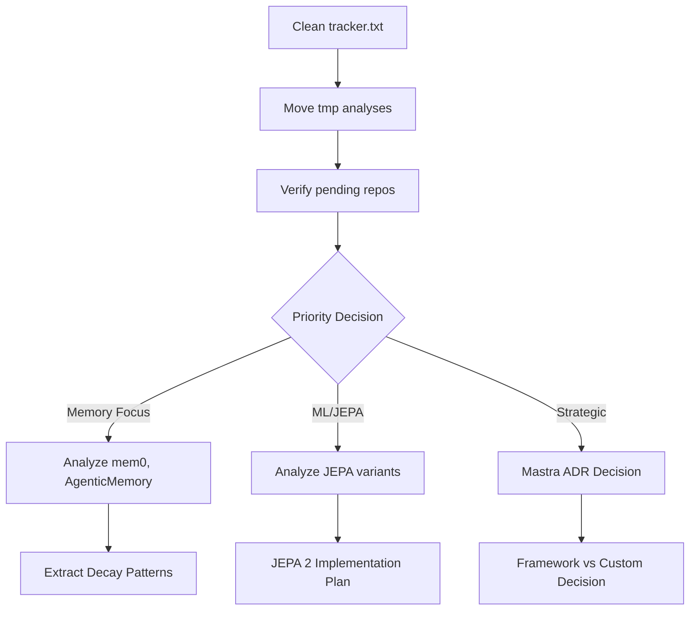

# 🗂️ Workshop Analysis Organization Status Report

_Generated: 2025-06-25_
_Purpose: Organize and verify workshop analyses_

## 📊 Current Analysis State

### 1. **Analysis Locations Found**

```yaml
locations:
  workshop/analysis/:
    - 28 directories with analyses
    - Key items: mcp/, mastra/, gemini-cli/, ml research folders
    - Plus standalone files: ml.md, ml-adr-checklist.md

  workshop/tmp/:
    - 9 auto-processed analyses (*.md files)
    - auto-runs/ directory (not explored yet)
    - Format: [slug]-analysis.md

  workshop/analysis/mcp/:
    - HIGH-PRIORITY-MCP-SUMMARY.md
    - MCP-REANALYSIS-SUMMARY.md
    - DECAY-LEARNING-IMPLEMENTATION-PLAN.md
    - 5 individual MCP server analyses
```

### 2. **Intake vs Auto Process Comparison**

```yaml
intake_process (intake.md):
  purpose: 'Interactive or autonomous 6-step deep analysis'
  workflow:
    - Step 1: Cache scan
    - Step 2: Source acquisition
    - Step 3: Lev system scan (CRITICAL)
    - Step 4: Comprehensive evaluation
    - Step 5: Decision & post-processing
    - Step 6: Documentation/POC
  output: 'workshop/analysis/[repo-name]/analysis.md'

auto_process (_auto.md):
  purpose: 'Catch-up bulk processing'
  workflow:
    - Read tracker.txt
    - Find unprocessed repos
    - Deep code scan
    - Strategic assessment
    - Save to tmp/[slug]-analysis.md
  tracking: 'workshop/tracker.txt'
```

### 3. **Tracker Status Issues**

```yaml
tracker_problems:
  - Duplicate entries found
  - Inconsistent formatting
  - Some entries with annotations like "[POC-DAY-3-COMPLETE-MEMORY-INTEGRATION]"

tracked_items:
  - ai-engineering-hub-colivara-deepseek-website-rag
  - ultimate-mcp-server
  - mastra
  - 1Panel (+ 1Panel-frontend)
  - A5-Browser-Use
  - aci
  - activepieces
  - ag-ui-protocol
  - ottomator-agents
  - open-webui
```

### 4. **Analyses in tmp/ Needing Migration**

| Analysis File                   | Status                      | Action Needed                           |
| ------------------------------- | --------------------------- | --------------------------------------- |
| mastra-analysis.md              | Strategic evaluation needed | Move to analysis/mastra/ + ADR decision |
| ultimate-mcp-server-analysis.md | Complete                    | Move to analysis/ultimate-mcp-server/   |
| 1panel-analysis.md              | Complete                    | Move to analysis/1Panel/                |
| activepieces-analysis.md        | Complete                    | Move to analysis/activepieces/          |
| aci-analysis.md                 | Complete                    | Move to analysis/aci/                   |
| a5-browser-use-analysis.md      | Complete                    | Move to analysis/A5-Browser-Use/        |
| ag-ui-protocol-analysis.md      | Complete                    | Move to analysis/ag-ui-protocol/        |
| ai-engineering-hub-\*           | Complete                    | Move to appropriate folder              |
| 1Panel-frontend-analysis.md     | Complete                    | Merge with 1Panel folder                |

### 5. **Repos in intake/ Still Needing Analysis**

**High Priority (Memory/Learning Focus):**

- memory-bank-ai-agent-productivity/
- mem0/
- AgenticMemory/
- Cerebrum/

**ML/JEPA Related:**

- ijepa/, vjepa2/, SEAL/, Sealing/, LumenPallidium-jepa/
- vicreg/, swav/, mae/, dreamerv3/

**Framework/Platform:**

- gemini-cli/, fast-agent/, graphiti/
- CopilotKit/, dify/, anything-llm/

**Large Repositories (Need Sampling Strategy):**

- awesome-prompts/, awesome-claude-prompts/
- osint-tools/, OSINT-Framework/

## 🎯 Key Findings from Analyses

### 1. **Memory System Status** (from MCP analysis)

- Leviathan already has sophisticated 5-type memory system
- Building gRPC service for Graphiti
- **MISSING**: Decay management implementation
- **FOUND**: Decay algorithms in \_ref/mcp-ceo/ (need extraction)

### 2. **Critical Patterns to Extract**

- **Self-learning**: From mcp-agent (orchestrator, swarm, evaluator)
- **Decay algorithms**: From mcp-ceo/src/tracking/ContextTracker.js
- **Transport patterns**: Need to build WebSocket layer

### 3. **Strategic Decisions Pending**

- **Mastra Framework**: Major decision - adopt vs continue custom
- **JEPA 2 Implementation**: Based on research in \_03-jepa.md

## 📋 Recommended Actions

### Immediate Organization Tasks:

1. **Clean tracker.txt**:

   ```bash
   # Remove duplicates and clean formatting
   sort -u workshop/tracker.txt > workshop/tracker-clean.txt
   mv workshop/tracker-clean.txt workshop/tracker.txt
   ```

2. **Move tmp analyses to proper structure**:

   ```bash
   # For each analysis in tmp/
   mkdir -p workshop/analysis/[repo-name]/
   mv workshop/tmp/[slug]-analysis.md workshop/analysis/[repo-name]/analysis.md
   ```

3. **Verify intake repos vs analyzed**:
   ```bash
   # Generate list of unanalyzed repos
   ls workshop/intake/ | sort > all-repos.txt
   cat workshop/tracker.txt | sort > analyzed-repos.txt
   comm -23 all-repos.txt analyzed-repos.txt > pending-analysis.txt
   ```

### Strategic Priorities:

1. **Extract Decay Implementation**:

   - Copy from \_ref/mcp-ceo/src/tracking/ContextTracker.js
   - Integrate into packages/memory/src/decay/

2. **Self-Learning Patterns**:

   - Deep dive into mcp-agent patterns
   - Map to bubble-up/trickle-down architecture

3. **Memory-Focused Repos**:

   - Prioritize: mem0, AgenticMemory, Cerebrum
   - Compare against existing memory system

4. **Mastra Decision**:
   - Create ADR for framework evaluation
   - Major strategic fork in development

## 🚀 Next Steps Workflow



## ✅ Quality Verification Checklist

For each analysis, verify:

- [ ] Deep code analysis (not just README)
- [ ] Comparison to ACTUAL Leviathan capabilities
- [ ] Evidence-based findings (file references)
- [ ] Strategic assessment included
- [ ] Decision recommendation clear
- [ ] Integration opportunities identified

## 📊 Analysis Coverage Summary

```yaml
total_in_intake: 74 directories
analyzed_in_tmp: 9 items
analyzed_in_analysis: ~28 directories
pending_analysis: ~37 items
high_priority_pending: 7 (memory/learning focused)
```

## 🎯 Priority Order for Remaining Analyses

1. **Memory Systems**: mem0, AgenticMemory, Cerebrum, memory-bank-ai
2. **JEPA/ML**: ijepa, vjepa2, SEAL collection
3. **Frameworks**: gemini-cli, fast-agent, CopilotKit
4. **Large Collections**: Use sampling strategy for awesome-\* repos

---

**Recommendation**: First organize existing analyses, then continue with memory-focused repos using the intake.md process for deep analysis.
