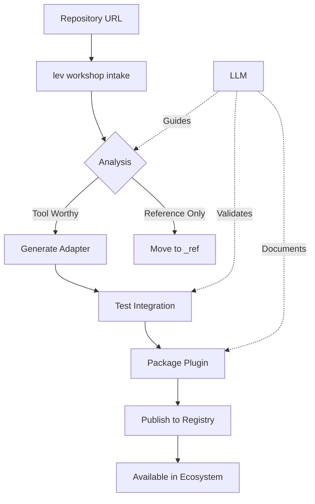

# ADR-012: Workshop Plugin Vision - Automatic Tool Integration

## Status

Proposed

## Context

The grand vision: "intake a repo, hook it up as a tool, and expose it to the lev ecosystem." We're building the Linux of AI where any tool can plug in seamlessly. The workshop plugin should enable:

- Zero-friction tool integration
- Automatic adapter generation
- Community-driven ecosystem growth
- LLM-first architecture patterns

## Decision

Create a workshop plugin that automates the entire tool integration pipeline from repository intake to ecosystem deployment.

### Core Vision

```
Repository → Analysis → Adapter → Tool → Plugin → Ecosystem
```

### Architectural Components

#### 1. Intake System

- Crawl repositories recursively
- Analyze code structure and patterns
- Score tool integration potential
- Generate technical assessments

#### 2. Adapter Generator

- Language-agnostic wrapper generation
- MCP protocol compliance
- Dependency management
- Error handling patterns

#### 3. Tool Registry

- Centralized tool discovery
- Capability indexing
- Version management
- Usage analytics

#### 4. Plugin Packager

- npm package generation
- @lev-os namespace management
- Auto-documentation
- Distribution ready

### Workflow Architecture



### Key Innovations

#### 1. LLM-Driven Analysis

```javascript
// Let LLM analyze code semantics, not just syntax
const analysis = await llm.analyze({
  prompt: `Analyze this repository for tool integration potential.
           Consider: API design, value transformation, statelessness.`,
  code: repoContents,
})
```

#### 2. Bi-Directional Integration

```javascript
// Tools can call back to LLM for enhanced processing
export const enhancedTool = {
  handler: async (args, deps) => {
    const result = await runTool(args)

    // Return to LLM for enhancement
    return {
      type: 'needs_enhancement',
      data: result,
      prompt: 'Analyze and enhance these results',
    }
  },
}
```

#### 3. Zero-Configuration Bootstrap

```javascript
// Auto-detect and configure without manual setup
await workshop.integrate('https://github.com/user/repo')
// Automatically:
// - Clones repo
// - Analyzes structure
// - Generates adapter
// - Creates plugin
// - Deploys to ecosystem
```

### Implementation Phases

#### Phase 1: Foundation (Current)

- Repository intake and analysis
- Basic adapter generation
- Manual plugin creation

#### Phase 2: Automation

- Auto-adapter generation
- Language detection and handling
- Dependency resolution

#### Phase 3: Intelligence

- LLM-guided optimization
- Performance profiling
- Security scanning

#### Phase 4: Ecosystem

- Community marketplace
- Tool composition
- Workflow marketplace

### Example: OSINTai Integration

```bash
# One command to rule them all
lev workshop integrate workshop/intake/OSINTai

# Behind the scenes:
# 1. Analyzes Python structure
# 2. Identifies WebCrawler class
# 3. Generates MCP adapter
# 4. Creates @lev-os/osint-ai plugin
# 5. Publishes to ecosystem
# 6. Available: lev osint crawl https://example.com
```

### Success Metrics

1. **Time to Integration**: < 5 minutes from repo to tool
2. **Success Rate**: > 80% of viable repos auto-integrate
3. **Community Growth**: 100+ tools in first year
4. **LLM Enhancement**: 50% of tools use bi-directional flow

## Consequences

### Positive

- Explosive ecosystem growth
- Community-driven innovation
- Reduced integration friction
- Standardized tool patterns

### Negative

- Quality control challenges
- Security concerns
- Dependency management complexity
- Performance overhead

## Technical Specifications

### Tool Manifest Schema

```yaml
name: '@lev-os/tool-name'
version: '1.0.0'
type: 'command' | 'service' | 'workflow'
capabilities:
  - search
  - analyze
  - transform
dependencies:
  runtime: 'python' | 'node' | 'go'
  packages: []
  services: []
integration:
  adapter: './adapters/main.js'
  original: './original-repo/'
  tests: './tests/'
```

### Workshop Plugin API

```javascript
// Core commands for the workshop plugin
export const workshopCommands = {
  // Intake and analyze
  'workshop:intake': intakeRepository,
  'workshop:analyze': analyzeToolPotential,

  // Integration pipeline
  'workshop:integrate': generateIntegration,
  'workshop:test': testIntegration,
  'workshop:package': packagePlugin,
  'workshop:publish': publishToEcosystem,

  // Management
  'workshop:list': listIntegrations,
  'workshop:update': updateIntegration,
  'workshop:remove': removeIntegration,
}
```

## Future Vision

### The Linux of AI

- Package manager for AI tools (like apt/yum)
- Dependency resolution and versioning
- Community repositories
- Tool composition and pipelines

### Ecosystem Evolution

```
2025: 100 tools, manual curation
2026: 1000 tools, auto-integration
2027: 10000 tools, AI-managed ecosystem
2028: Self-organizing tool networks
```

## References

- Linux package management systems
- npm ecosystem growth patterns
- MCP protocol extensibility
- Community-driven development models
