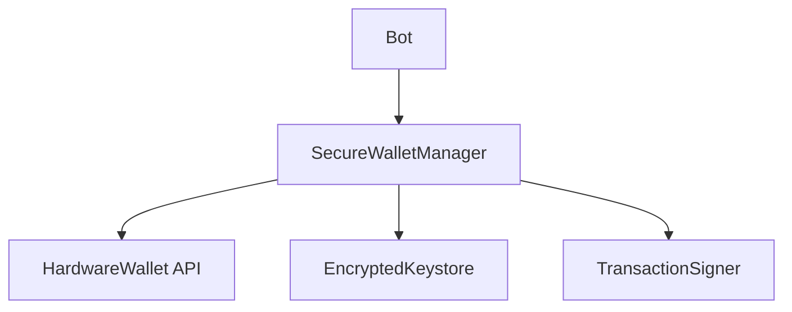

# Context CTX-002-architecture
Task: TASK-002 - Implement secure wallet manager
Type: architecture
Created: 2025-05-23T15:00:00Z

## Architecture Decision

Replace plaintext private key storage with secure wallet abstraction layer.

## Design

## Key Decisions

1. **Hardware Wallet Support**: Primary security mechanism
   - Rationale: Industry standard, air-gapped key storage
   - Trade-off: Slightly more complex integration

2. **Async-First API**: All signing operations return Promises
   - Rationale: Hardware wallets have variable response times
   - Implementation: Promise-based interface throughout

## Security Requirements
- Private keys never exposed in plaintext
- All key operations through abstraction layer
- Audit trail for all signing operations