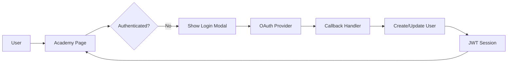

# Context CTX-002-auth-architecture
Task: TASK-002 - Add authentication to AI Academy
Type: architecture
Created: 2025-05-23T15:00:00Z

## Architecture Decision

Use OAuth 2.0 social login (Google, LinkedIn, GitHub) with JWT session management.

## Flow

## Technical Decisions
1. **NextAuth.js** - Handles OAuth flow and session management
2. **PostgreSQL** - Store user profiles and learning progress
3. **JWT in httpOnly cookies** - Secure session storage
4. **Social providers only** - No password management needed

## API Endpoints
- `/api/auth/[...nextauth]` - NextAuth handler
- `/api/auth/session` - Get current session
- `/api/auth/signout` - Clear session